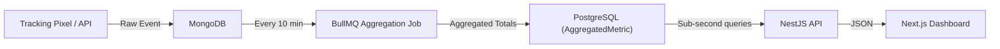

# Event Insights Platform — Monolith Canonical System

Initialize a production-grade NestJS monolith with a **domain-driven modular core**, dual-database architecture (PostgreSQL + MongoDB), a read-heavy analytics pipeline powered by BullMQ, and a **Next.js dashboard** for serving aggregated analytics with sub-second load times.

## User Review Required

> [!IMPORTANT]
> **Dual-Database Architecture**: PostgreSQL (via Prisma) handles relational data (orgs, users, events, aggregated metrics). MongoDB (via Mongoose) handles high-throughput raw event streaming. This is intentional for the read-heavy optimization pattern.

> [!IMPORTANT]
> **BullMQ + Redis**: The analytics pipeline uses BullMQ (Redis-backed) for scheduled aggregation jobs every 10 minutes. Docker Compose will provision PostgreSQL, MongoDB, and Redis.

> [!IMPORTANT]
> **Monorepo Structure**: The project uses a pnpm workspace monorepo — `apps/api` (NestJS backend) and `apps/web` (Next.js dashboard) with shared TypeScript types in `packages/shared-types`.

---

## Proposed Changes

### 1. Project Scaffolding (Monorepo Root)

#### [NEW] [package.json](file:///Users/micko.matamorosa/Documents/sr%20-%20learnings/event-insights-platform/package.json)
Pnpm workspace root with scripts for both `api` and `web` apps.

#### [NEW] [pnpm-workspace.yaml](file:///Users/micko.matamorosa/Documents/sr%20-%20learnings/event-insights-platform/pnpm-workspace.yaml)
Defines workspace packages: `apps/*`, `packages/*`.

#### [NEW] [.env](file:///Users/micko.matamorosa/Documents/sr%20-%20learnings/event-insights-platform/.env)
Environment variables for database URLs, JWT secret, Redis URL, and API URL for frontend.

#### [NEW] [docker-compose.yml](file:///Users/micko.matamorosa/Documents/sr%20-%20learnings/event-insights-platform/docker-compose.yml)
Services: PostgreSQL (5432), MongoDB (27017), Redis (6379).

#### [NEW] [apps/api/package.json](file:///Users/micko.matamorosa/Documents/sr%20-%20learnings/event-insights-platform/apps/api/package.json)
NestJS backend dependencies: `@nestjs/*`, `@prisma/client`, `mongoose`, `bullmq`, `passport-jwt`, `zod`.

#### [NEW] [apps/api/tsconfig.json](file:///Users/micko.matamorosa/Documents/sr%20-%20learnings/event-insights-platform/apps/api/tsconfig.json)
Strict TypeScript config with path aliases (`@shared/*`, `@modules/*`, `@infra/*`).

#### [NEW] [apps/api/nest-cli.json](file:///Users/micko.matamorosa/Documents/sr%20-%20learnings/event-insights-platform/apps/api/nest-cli.json)
NestJS CLI configuration.

#### [NEW] [apps/web/package.json](file:///Users/micko.matamorosa/Documents/sr%20-%20learnings/event-insights-platform/apps/web/package.json)
Next.js dashboard dependencies: `next`, `react`, `recharts`, `@tanstack/react-query`, `tailwindcss`.

#### [NEW] [packages/shared-types/package.json](file:///Users/micko.matamorosa/Documents/sr%20-%20learnings/event-insights-platform/packages/shared-types/package.json)
Shared TypeScript interfaces consumed by both `api` and `web`.

---

### 2. Canonical Directory Structure

```
/                                     # Monorepo root
├── pnpm-workspace.yaml
├── docker-compose.yml
├── .env
│
├── packages/shared-types/            # Shared TS interfaces
│   ├── index.ts
│   └── src/
│       ├── analytics.types.ts
│       ├── auth.types.ts
│       └── event.types.ts
│
├── apps/api/src/                     # NestJS Backend
│   ├── main.ts
│   ├── app.module.ts
│   ├── infrastructure/
│   │   ├── prisma/
│   │   │   ├── prisma.module.ts
│   │   │   ├── prisma.service.ts
│   │   │   └── schema.prisma
│   │   └── mongoose/
│   │       └── mongoose-config.module.ts
│   ├── shared/
│   │   ├── decorators/
│   │   │   ├── current-user.decorator.ts
│   │   │   └── org-id.decorator.ts
│   │   ├── guards/
│   │   │   ├── jwt-auth.guard.ts
│   │   │   └── tenant.guard.ts
│   │   ├── pipes/
│   │   │   └── zod-validation.pipe.ts
│   │   ├── interfaces/
│   │   │   ├── base-repository.interface.ts
│   │   │   └── pagination.interface.ts
│   │   └── launchers/
│   │       └── analytics.launcher.ts
│   └── modules/
│       ├── auth/
│       │   ├── auth.module.ts
│       │   ├── auth.controller.ts
│       │   ├── auth.service.ts
│       │   ├── strategies/jwt.strategy.ts
│       │   └── dto/
│       ├── organizations/
│       │   ├── organizations.module.ts
│       │   ├── organizations.controller.ts
│       │   ├── organizations.service.ts
│       │   └── organizations.repository.ts
│       ├── users/
│       │   ├── users.module.ts
│       │   ├── users.controller.ts
│       │   ├── users.service.ts
│       │   └── users.repository.ts
│       ├── events/
│       │   ├── events.module.ts
│       │   ├── events.controller.ts
│       │   ├── events.service.ts
│       │   ├── events.repository.ts
│       │   └── dto/create-event.dto.ts
│       └── analytics/
│           ├── analytics.module.ts
│           ├── analytics.controller.ts
│           ├── analytics.service.ts
│           ├── analytics.repository.ts
│           ├── schemas/raw-event.schema.ts
│           ├── processors/aggregation.processor.ts
│           └── dto/query-metrics.dto.ts
│
└── apps/web/                         # Next.js Dashboard
    ├── next.config.js
    ├── tailwind.config.ts
    ├── src/
    │   ├── app/
    │   │   ├── layout.tsx             # Root layout (dark theme, sidebar)
    │   │   ├── page.tsx               # Dashboard home (redirect)
    │   │   ├── (auth)/
    │   │   │   ├── login/page.tsx
    │   │   │   └── register/page.tsx
    │   │   └── (dashboard)/
    │   │       ├── layout.tsx          # Sidebar + topbar shell
    │   │       ├── overview/page.tsx   # KPI cards + charts
    │   │       ├── events/page.tsx     # Event definitions list
    │   │       └── analytics/page.tsx  # Deep analytics view
    │   ├── components/
    │   │   ├── ui/                     # Reusable primitives
    │   │   │   ├── button.tsx
    │   │   │   ├── card.tsx
    │   │   │   ├── sidebar.tsx
    │   │   │   └── data-table.tsx
    │   │   └── charts/
    │   │       ├── metric-card.tsx
    │   │       ├── line-chart.tsx
    │   │       └── bar-chart.tsx
    │   ├── lib/
    │   │   ├── api-client.ts          # Axios/fetch wrapper
    │   │   └── auth.ts                # Token storage + refresh
    │   ├── hooks/
    │   │   ├── use-auth.ts
    │   │   └── use-metrics.ts
    │   └── providers/
    │       ├── query-provider.tsx      # React Query
    │       └── auth-provider.tsx       # JWT context
    └── public/
```

---

### 3. Database Schemas

#### [NEW] [schema.prisma](file:///Users/micko.matamorosa/Documents/sr%20-%20learnings/event-insights-platform/src/infrastructure/prisma/schema.prisma)

**PostgreSQL tables**:
- `Organization` — multi-tenant root (`id`, `name`, `slug`, `createdAt`)
- `User` — belongs to org (`id`, `email`, `passwordHash`, `role`, `orgId`)
- `Event` — trackable event definitions (`id`, `name`, `type`, `orgId`)
- `AggregatedMetric` — pre-computed analytics (`id`, `eventId`, `orgId`, `metricType`, `value`, `periodStart`, `periodEnd`)

#### [NEW] [raw-event.schema.ts](file:///Users/micko.matamorosa/Documents/sr%20-%20learnings/event-insights-platform/src/modules/analytics/schemas/raw-event.schema.ts)

**MongoDB collection** (`raw_events`):
- `eventId`, `orgId`, `sessionId`, `payload` (Mixed), `userAgent`, `ipAddress`, `timestamp`

---

### 4. Global Middlewares

| Middleware | File | Purpose |
|---|---|---|
| JWT Auth Guard | `shared/guards/jwt-auth.guard.ts` | Validates Bearer token via Passport-JWT |
| Tenant Guard | `shared/guards/tenant.guard.ts` | Extracts `org_id` from JWT claims, attaches to request |
| Zod Validation Pipe | `shared/pipes/zod-validation.pipe.ts` | Validates DTOs using Zod schemas |
| `@CurrentUser()` | `shared/decorators/current-user.decorator.ts` | Extracts user from request |
| `@OrgId()` | `shared/decorators/org-id.decorator.ts` | Extracts org_id from request |

---

### 5. Analytics Pipeline (Read-Heavy Optimization)



1. **Ingestion**: `POST /analytics/track` → validates → writes to MongoDB `raw_events`
2. **Aggregation**: BullMQ processor runs on `analytics-aggregation` queue every 10 min, reads raw events, computes totals per event per hour
3. **Storage**: Upserts `AggregatedMetric` rows in PostgreSQL
4. **Serving**: `GET /analytics/metrics` queries PostgreSQL → Next.js dashboard renders charts via React Query + Recharts

---

### 6. Internal Launcher (Cross-Module Communication)

#### [NEW] [analytics.launcher.ts](file:///Users/micko.matamorosa/Documents/sr%20-%20learnings/event-insights-platform/src/shared/launchers/analytics.launcher.ts)

Injectable service that the `events` module uses to trigger analytics tracking without importing the `analytics` module directly. Uses an interface-based contract to prevent circular dependencies.

---

### 7. Next.js Dashboard Frontend

| Page | Purpose |
|---|---|
| `(auth)/login` | JWT login form → stores token |
| `(auth)/register` | Registration with org creation |
| `(dashboard)/overview` | KPI metric cards + line charts (Recharts) |
| `(dashboard)/events` | Event definitions CRUD table |
| `(dashboard)/analytics` | Deep analytics with date filters, bar charts |

**Key frontend patterns**:
- **React Query** for server state (auto-refresh metrics every 30s)
- **Axios client** with JWT interceptor (auto-attach Bearer token)
- **Auth provider** context with token refresh logic
- **Recharts** for data visualization (line, bar, area charts)
- **Tailwind CSS** for styling with a dark-mode-first design system

---

## Verification Plan

### Automated Tests

1. **API — TypeScript Compilation**:
   ```bash
   cd apps/api && npx tsc --noEmit
   ```

2. **API — Prisma Schema Validation**:
   ```bash
   npx prisma validate --schema=apps/api/src/infrastructure/prisma/schema.prisma
   ```

3. **API — NestJS Build**:
   ```bash
   cd apps/api && npx nest build
   ```

4. **Web — Next.js Build**:
   ```bash
   cd apps/web && npx next build
   ```

### Manual Verification

1. **Circular Dependency Check**: Inspect module imports — all cross-module comm goes through shared launchers.
2. **Docker Compose**: `docker-compose up -d` to verify PostgreSQL, MongoDB, and Redis start.
3. **Dashboard**: `cd apps/web && npm run dev` — verify login page and dashboard shell render.
